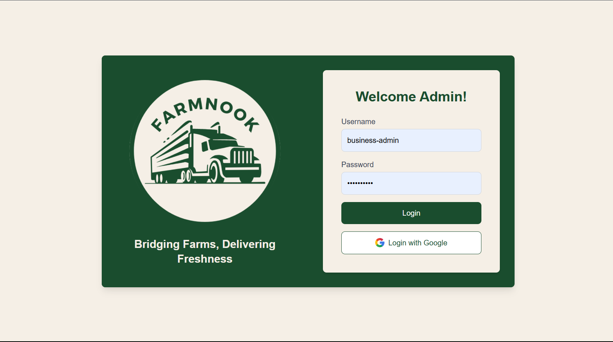

# Farmnook Website



## 🌱 About Farmnook

Farmnook is a modern and intuitive web and mobile platform designed to simplify farm management, connect farmers with buyers, and enhance agricultural productivity through technology.

## 🚀 Tech Stack

### Frontend:

- ⚛️ **React.js** – For a dynamic and responsive UI
- 🎨 **Tailwind CSS** – For modern, utility-first styling
- 🖼 **HTML & CSS** – Core web structure and styling
- ⚡ **Vite** – Fast development build tool for React

### Backend:

- 🐍 **Python** – Server-side logic and API development

### Mobile:

- 📱 **Android SDK** – For mobile application support

## 📂 Project Structure

```bash
farmnook/
│── frontend/      # React.js application
│── backend/       # Python API and backend services
│── mobile/        # Android SDK implementation
│── assets/        # Images, UI elements
└── README.md      # Project documentation
```

## 🎯 Features

- 🌾 **Farm Management** – Organize crops, livestock, and farm activities.
- 🛒 **Marketplace** – Connect farmers with potential buyers.
- 📈 **Analytics** – Monitor farm performance with insightful data.
- 📲 **Mobile Accessibility** – Manage your farm on the go.

## 📜 Installation & Setup

```sh
# Clone the repository
git clone https://github.com/yourusername/farmnook.git

# Navigate to the project directory
cd farmnook

# Install dependencies
npm install  # For frontend
pip install -r requirements.txt  # For backend

# Run the development servers
npm start  # React frontend
python backend/app.py  # Backend API
```

## ⚡ React + Vite

This project is powered by **Vite**, a fast build tool for modern web development. We support Hot Module Replacement (HMR) and optimized bundling.

### Available Plugins:

- [@vitejs/plugin-react](https://github.com/vitejs/vite-plugin-react/blob/main/packages/plugin-react/README.md) – Uses [Babel](https://babeljs.io/) for Fast Refresh.
- [@vitejs/plugin-react-swc](https://github.com/vitejs/vite-plugin-react-swc) – Uses [SWC](https://swc.rs/) for Fast Refresh.

## 📢 Contributing

We welcome contributions! If you’d like to contribute:

- Fork the repo and create a feature branch.
- Submit a pull request with a detailed description.

## 📄 License

This project is licensed under the MIT License – see the [LICENSE](LICENSE) file for details.

---

🔗 **Follow us on GitHub:** [Farmnook Repo](https://github.com/yourusername/farmnook)
